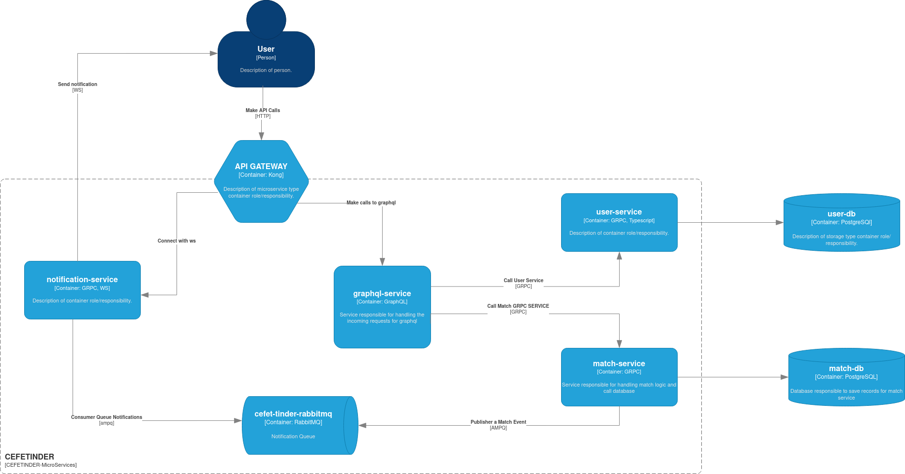

# CEFETinder ❤️


Um aplicativo de encontros para estudantes do CEFET, desenvolvido com arquitetura de microsserviços.

## Arquitetura

O projeto utiliza uma arquitetura de microsserviços com os seguintes componentes:



- **Kong API Gateway**: Roteamento e gerenciamento de APIs
- **GraphQL**: API GraphQL para o frontend e gerenciamento de rotas
- **User Service**: Gerenciamento de usuários e preferências (gRPC)
- **Match Service**: Sistema de matching e likes (gRPC)
- **Notification Service**: Sistema de notificações em tempo real (WebSocket)

### Estrutura do projeto

- `src/services/user`: Serviço de gerenciamento de usuários
- `src/services/match`: Serviço de sistema de matching
- `src/services/notification`: Serviço de notificações em tempo real

#### GraphQL

Utilizamos o TypeGraphQL para definir o esquema GraphQL e os resolvers.

Os schemas estão definidos em `src/graphql/types` e os resolvers em `src/graphql/resolvers`.

O schema principal é montado dinamicamente em `src/graphql/schema.ts`, utilizando o TypeGraphQL.

#### gRPC

Os serviços de User e Match se comunicam via gRPC.

O projeto utiliza typescript, dessa forma, é possível gerar os tipos automaticamente a partir dos arquivos .proto.

Basta rodar o comando:

```bash
npm run generate:proto
```

Os arquivos gerados ficarão na pasta `src/proto`.

## Pré-requisitos

Antes de rodar o projeto, certifique-se de ter instalado:

- Docker e Docker Compose

## Executando o projeto com Docker Compose

Instale as dependências e inicie os serviços com Docker Compose:

```bash
docker-compose up --build -d
```

## Funcionamento do API Gateway (Kong)

O Kong API Gateway gerencia o roteamento das requisições para os serviços apropriados. Ele expõe as seguintes rotas:

- `/graphql`: Rota para o serviço GraphQL
- `/notifications`: Rota para o serviço de notificações

Os únicos serviços expostos externamente são o GraphQL e o Notification Service. Os serviços de User e Match são acessados internamente via gRPC.

## WebSocket para Notificações em Tempo Real

O Notification Service utiliza WebSocket para enviar notificações em tempo real aos usuários sobre novos matches e mensagens. O serviço escuta conexões WebSocket na rota `/notifications`.

O frontend pode se conectar ao WebSocket da seguinte forma:

```javascript
const socket = new WebSocket('ws://<KONG_API_GATEWAY_URL>/notifications');
socket.onmessage = function(event) {
    const notification = JSON.parse(event.data);
    console.log('Nova notificação:', notification);
};
```

## Design Patterns Utilizados

1. **Observer**

   - Implementado no sistema de notificações
   - Permite que usuários recebam atualizações em tempo real sobre matches

2. **Strategy**

   - Usado no sistema de matching
   - Permite diferentes algoritmos de matching baseados em critérios específicos

3. **Singleton**

   - Usado nas conexões com Supabase
   - Garante uma única instância de conexão com o banco de dados

### Design Patterns Sugeridos

- **Factory Method**: Para criação de diferentes tipos de serviços e conexões
- **Decorator**: Para adicionar logging, validação e métricas aos resolvers

## Tecnologias

- TypeScript
- GraphQL
- gRPC
- Supabase (PostgreSQL)
- WebSocket

## Funcionalidades

- Filtros por idade, gênero e interesses
- Sistema de likes e super likes
- Notificações em tempo real de matches
- Gerenciamento de sessões ativas
- Sistema de matchmaking

## To-do

- Implementar Design Patterns sugeridos
- Implementar principios SOLID
- Abstrair camada de banco de dados